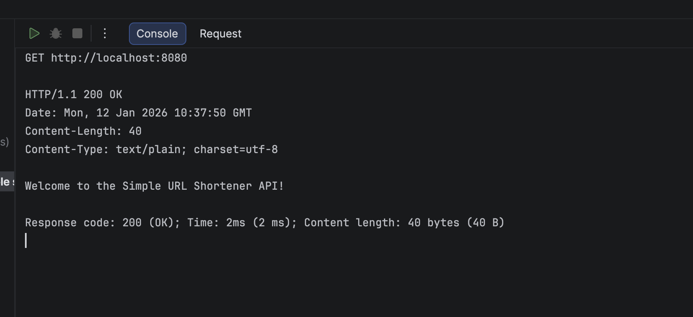
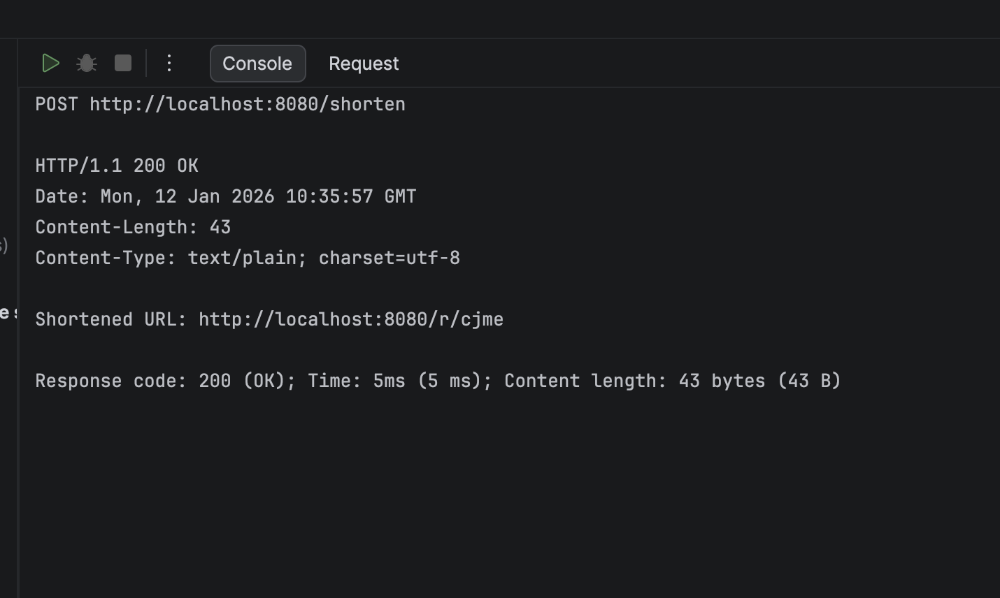
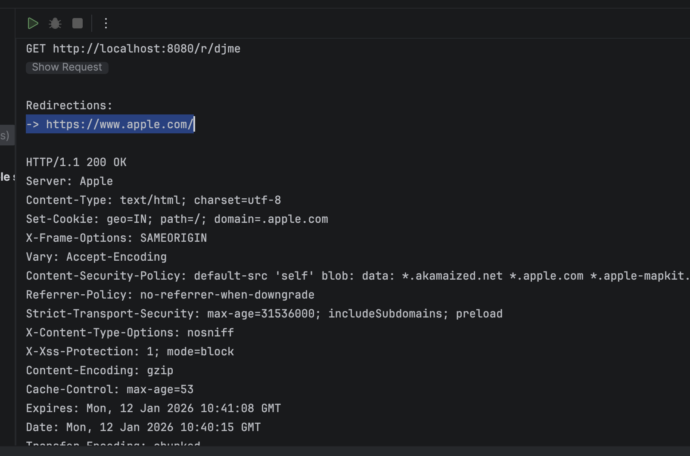
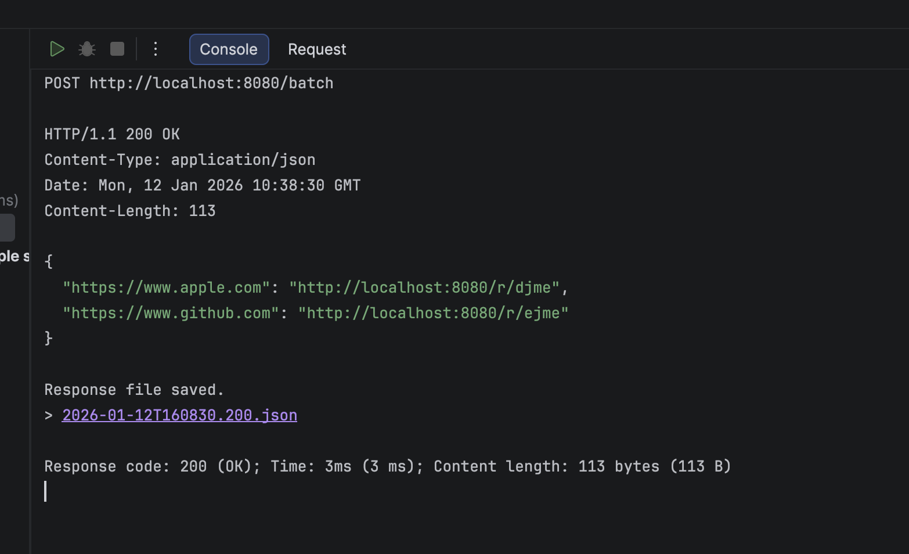

## ✨ Key Features

https://github.com/user-attachments/assets/a5c0e70d-a73e-4607-abc1-e7f21767668a

- **Deterministic Hashing:** Every URL gets a unique, short ID based on an internal counter.
- **Blazing Fast:** Since everything is stored in memory, redirects happen almost instantly.
- **Bulk Processing:** I added a batch route so you can shorten multiple links in one go.
- **Zero Dependencies:** Built entirely using the Go standard library (`net/http`).

---

## 📸 How It Works (My Test Results)

### 1. The Welcome Screen
Just a simple check to make sure the server is healthy.
- **Endpoint:** `GET /`
  

### 2. Shortening a URL
Here, I send a JSON body with the original link, and the server returns the new shortened link.
- **Endpoint:** `POST /shorten`
- **Body:** `{"url": "https://www.google.com"}`
  

### 3. The Redirect Logic
When you hit the `/r/{id}` route, the server looks up the ID and bounces you to the original site.
- **Endpoint:** `GET /r/{id}`
  

### 4. Handling Batch Requests
I designed this to accept a list of URLs and return a mapped response for all of them.
- **Endpoint:** `POST /batch`
- **Body:** `["https://apple.com", "https://github.com"]`
  

---

## 🧠 The Hashing Logic
I used **Base62 Encoding** for this. Instead of random letters
I take an incrementing counter (e.g., 10001) and convert it using
a character set of `a-z`, `A-Z`, and `0-9`. This ensures the URLs 
stay as short as possible while remaining unique.

